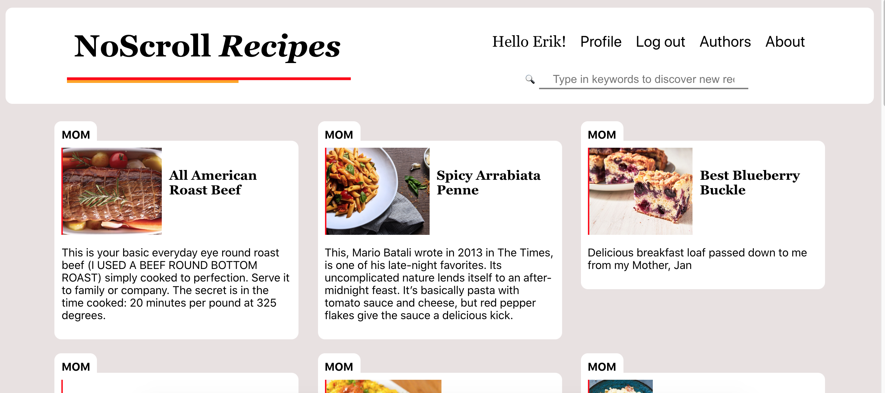

# NoScroll Recipes

*Micro Blogging MERN Application for Recipes*  - *Group Project for SEI 29 Seattle Unit 3*

[Live Demo HERE](https://sheamus-hei.github.io/noscroll-client/#/)

## Installation Instructions

NOTICE: Client folder is deprecated. Submit any pull requests to the separate client repo [here](https://github.com/sheamus-hei/noscroll-client). 

### Server

1. Fork and/or clone this repo.
2. `cd` into `server` and run `npm install`. 
3. `npx nodemon server.js` to run the server.

### Client

1. Fork and/or clone the client repo at [noscroll-client](https://github.com/sheamus-hei/noscroll-client).
2. Run `npm install`.
3. `npm start` to run the React client. 

## Technologies Used

* MongoDB
* Express.js
* React
* Node.js

# Project Evolution

### User Stories 

* “As a user, I want to find recipes that are easy to navigate to make cooking a less stressful experience and grow my culinary skills.”

*  “As a content creator, I want a place to post recipes where my readers can trust that my content will be accessible.”

### 1st Day - Thursday, March 13

Project began on day of team selection announcements. Last day of in campus instruction prior to moving to remote classes. Spent the day on decoupled app code-along, a functional team planning workshop - as well as installing Zoom for the upcoming remote classes. Our team began discussing ideas and making plans for the coming week.

### 2nd and 3rd Days - Saturday and Sunday, March 14th & March 15th

We made a final decision on idea - a No Scroll Recipe App that would allow users to see an entire recipe without scrolling. Users would able to save recipes and favorite recipes, share recipes, etc. Sheamus showed the team some initial wireframes.

Our team met on Zoom twice during these initial days. On Sunday we drew user flow charts and made additional wire frames incorporating various design ideas.

Team decided on some initial user stories. Made some initial user flow charts.

*Initial Site Map.*

### 4th Day - Monday March 16th

Project was pitched to instructors and approved to go forward. Model files with schemas and initial server side routes were planned. React Component Tree created.

#### User Schema

|Column | Type | Constraints |
|-------|---------------|---|
|name | String | Min length 1, max 99 |
|image | String |
| bio | Text|
|userRecipes | Embedded | Recipe IDs|
|favRecipes | Embedded |Recipe IDs|
|password | String | Bcypt, Required, Min length 8, max length 31 |
|email | String |Required, Unique, Min length 6|
	
### Recipe Schema

|Column | Type | Constraints |
|-------|------|-------------|
|title | String|
|image |String|
|alt | String|
|userId | ObjectId| Reference to User|
|date  | Date |
|servings | String |
|time | String |
|description | Text |Min 1 char, Max 280 |
|directions | Array of Strings |
| ingredients | Array of Strings|
| tags | Array of Strings | Tag ID |

*Component tree for the results page.*

Team began coding within the structure of a MERN application.

### 5th Day - Tuesday March 17th

Continued coding routes and structure for MongoDB schemas. Began testing routes using Postman and a basic seeder file.

#### ROUTES - Server

|Teammate|Type|Address|Description|
|---------|----|------|-----------|
|MAC|GET|/recipes|Retrieve recipes from db|
|MAC|GET|/recipes/:id|Retrieve single recipe from db|
|MAC|POST|/recipes|Add a new recipe to the db using form data|
|JOHN|PUT|/recipes/:id|Update recipe in db using form data|
|JOHN|DELETE|/recipes/:id|Delete a recipe from db|
|JOHN|PUT|/profile|Update user in db
|SHEAMUS|GET|/authors|Retrieve all authors from db|
|SHEAMUS|GET|/authors/:id| Retrieve an author from db|
|SHEAMUS|POST|/auth/login|Log user in|
|SHEAMUS|POST|/auth/signup|Create user in db

### 6th Day - Wednesday March 18th

Began working on client side routes in React. 

#### ROUTES - Client

|Teammate|Type|Address|Description|
|---------|----|------|-----------|
|MAC|GET|/recipes|Show homepage with recipe descriptions|
|MAC|GET|/recipes/new|Show a form to make a new recipe|
|MAC|GET|/recipes/:id|Show single recipe|
|JOHN|GET|recipes/:id/edit|Show a form to edit a recipe|
|SHEAMUS|GET|/profile|Show user profile|
|SHEAMUS|GET|/profile/edit|Show a form to edit profile|
|SHEAMUS|GET|/authors|Show list of all users who have posted recipes|
|SHEAMUS|GET|/authors/:id|Show the profile of one author |
|SHEAMUS|GET|/auth/login|Show a form to login|
|SHEAMUS|GET|/auth/signup|Show a form to sign up|

### 7th Day - Thursday March 19

Completed authentication files. Continued work on React functionality. More testing of React routes on client side.

### 8th Day - Friday March 20th

Continued work on React components. 

### 9th and 10th Day - Saturday and Sunday March 21st and 22nd

Began CSS stying styling and worked on debugging and adding functionality.

### 11th Day - Monday March 23rd

Worked with instructors on continued debugging.

## Unsolved Problems / Major Hurdles

* We will need to continue to debug for various edge cases
* We want to continue to add features
* Learning the gitflow and learning React were the major hurdles to overcome for this project

## STRETCH GOALS

* Allow users to add comments to recipes
* Use cloudinary API - allow users to upload profile photos, recipe photos
* Use twitter API/ OAuth - allow users to post recipe descriptions to twitter

## AKNOWLEDGEMENTS

* Our great instructors, Sarah King and Anna Zocher.
* Our terrific and generous helpers, Sean and Nick.
* Our super-cool classmates from SEI 29 General Assembly - Seattle

